# Lab_8 
|**Nama**|**NIM**|**Kelas**|**Matkul**|
|----|---|-----|------|
|Muhammad Fiqri Setyoadi|312210062|TI.22.A.2|Pemograman Web|

## Langkah-langkah Praktikum
- Menjalankan MySQL Server
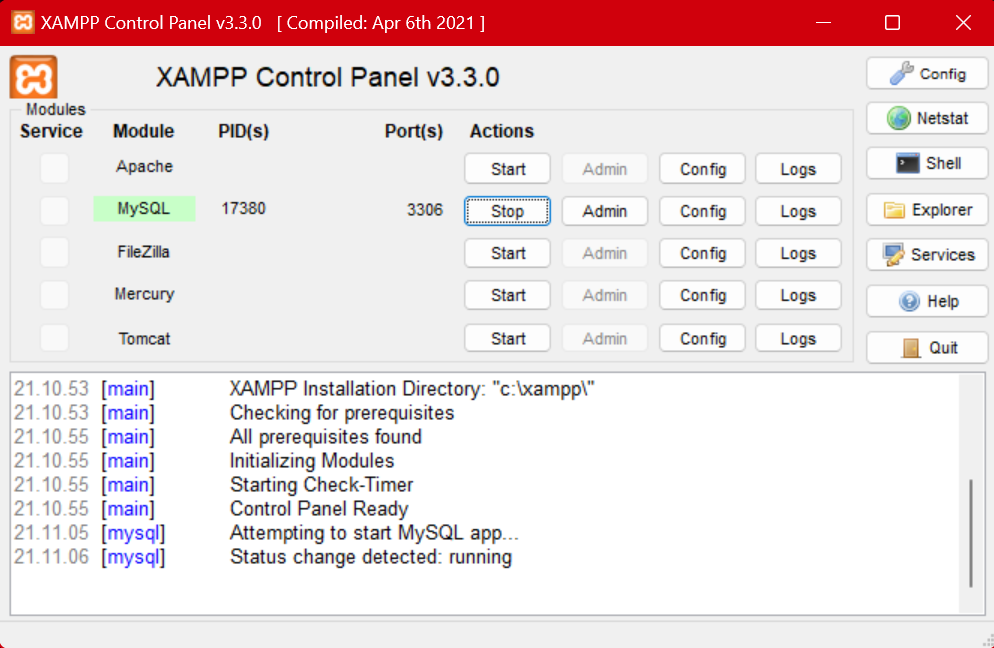

- Mengakses MySQL Client menggunakan PHP MyAdmin
    
    Pastikan webserver Apache dan MySQL server sudah dijalankan. Kemudian buka melalui browser: http://localhost/phpmyadmin/
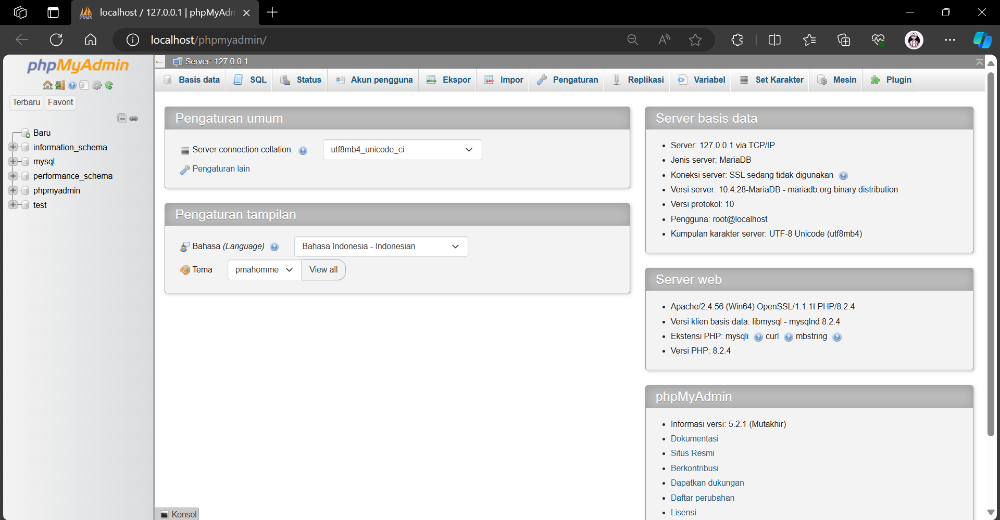

- Membuat Database

    ``CREATE TABLE data_barang (
    id_barang int(10) auto_increment Primary Key,
    kategori varchar(30),
    nama varchar(30),
    gambar varchar(100),
    harga_beli decimal(10,0),
    harga_jual decimal(10,0),
    stok int(4)
    );``
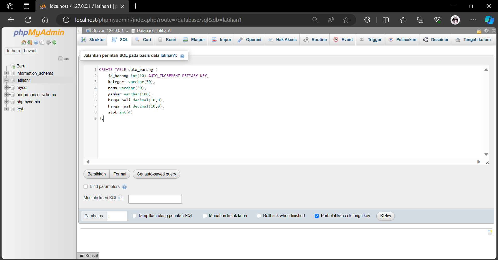

- Menambahkan Data

    ``INSERT INTO data_barang (kategori, nama, gambar, harga_beli, harga_jual, stok)
    VALUES ('Elektronik', 'HP Samsung Android', 'hp_samsung.jpg', 2000000, 2400000, 5),
    ('Elektronik', 'HP Xiaomi Android', 'hp_xiaomi.jpg', 1000000, 1400000, 5),
    ('Elektronik', 'HP OPPO Android', 'hp_oppo.jpg', 1800000, 2300000, 5);``
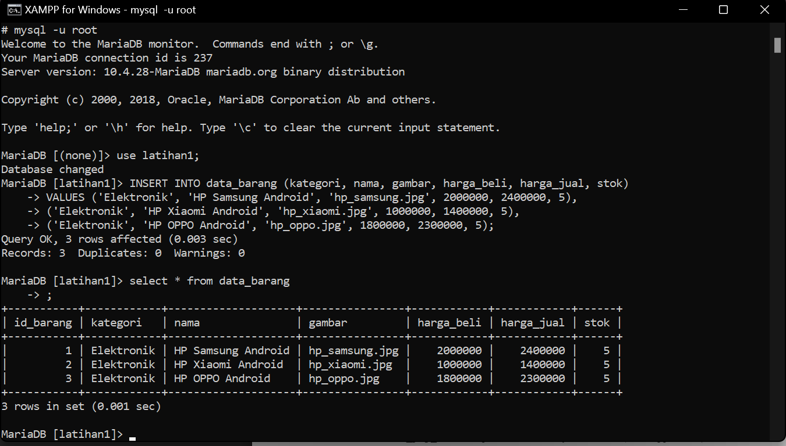

- Membuat Program CRUD
    Buat folder lab8_php_database pada root directory web server (d:\xampp\htdocs)
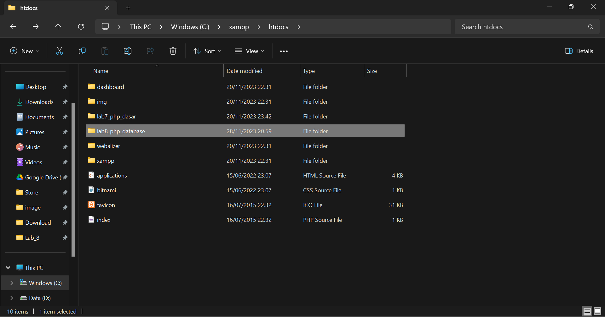
URL= http://localhost/lab8_php_database/
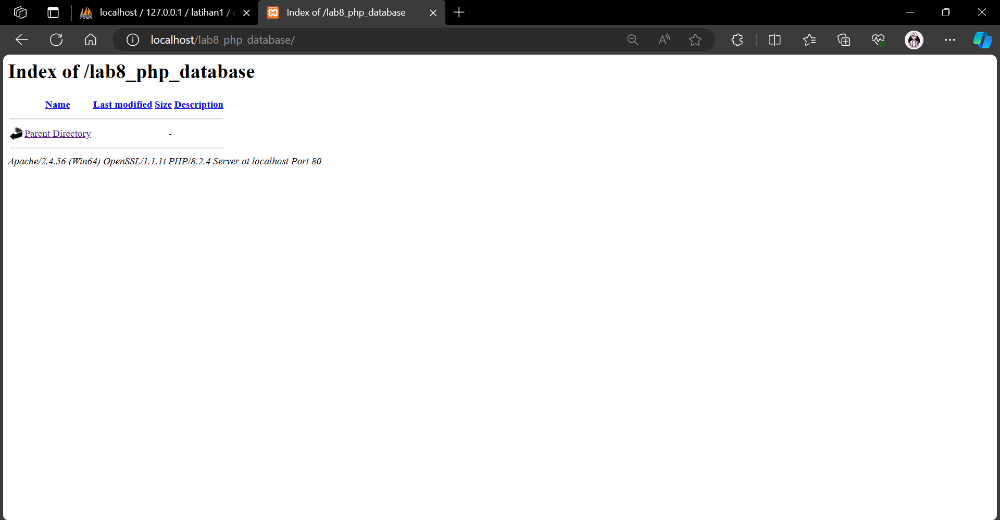

- Membuat file koneksi database
    
    Buat file baru dengan nama koneksi.php

    URL = http://localhost/lab8_php_database/koneksi.php
    
    Codingan => [klik ini](koneksi.php)
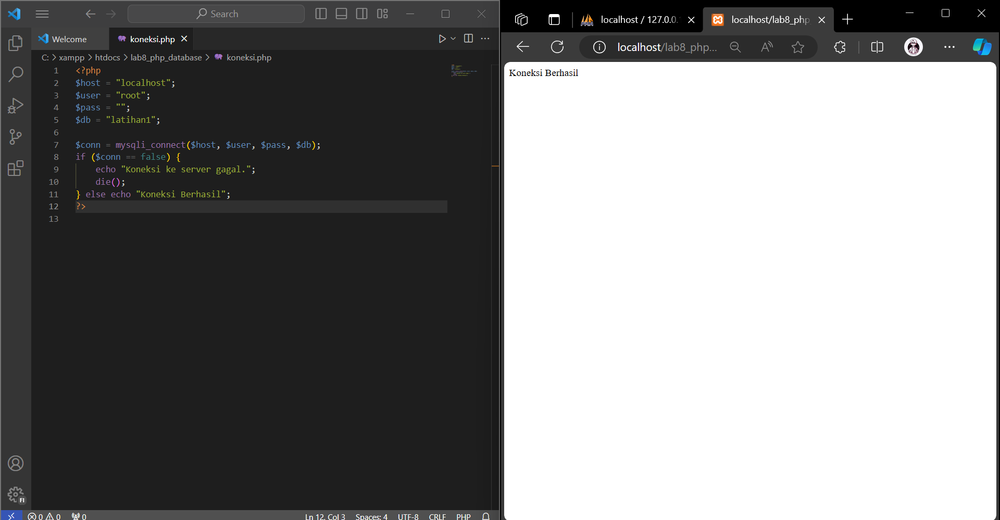

- Membuat file index untuk menampilkan data (Read)

    URL = http://localhost/lab8_php_database/index.php
    
    Codingan index.php => [klik ini](index.php)
    
    Codingan syle.css => [klik ini](style.css)
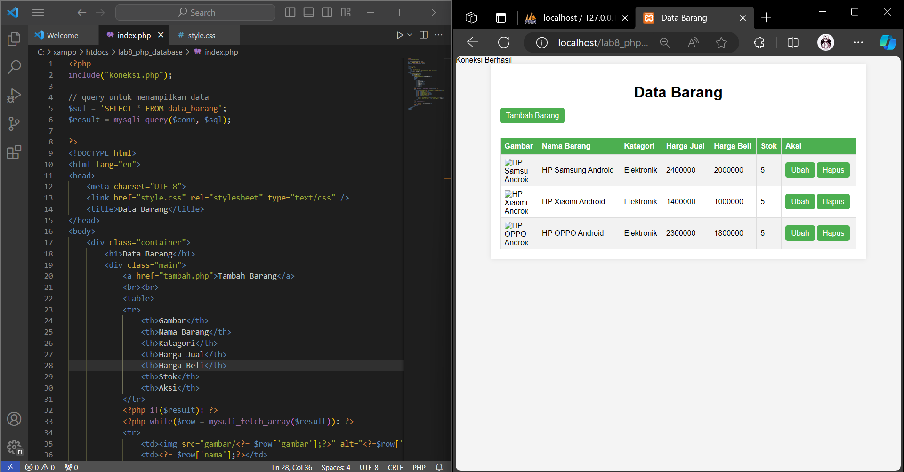

- Menambah Data (Create)
    Buat file baru dengan nama tambah.php
    
    URL = http://localhost/lab8_php_database/tambah.php

    Codingan => [klik ini](tambah.php)
    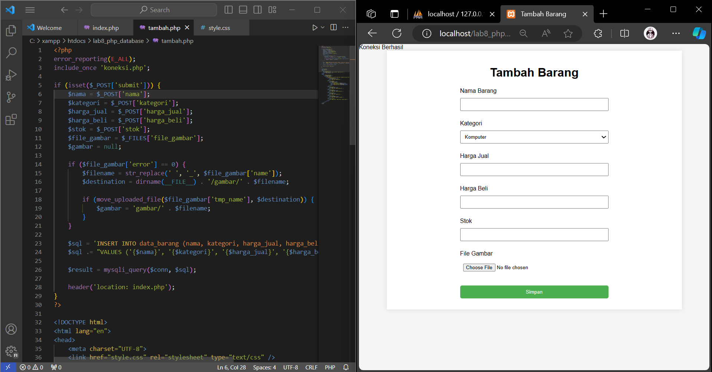

- Mengubah Data (Update)

    Buat file baru dengan nama ubah.php

    URL = http://localhost/lab8_php_database/ubah.php?id=1

    Coding ubah.php => [klik ini](ubah.php)
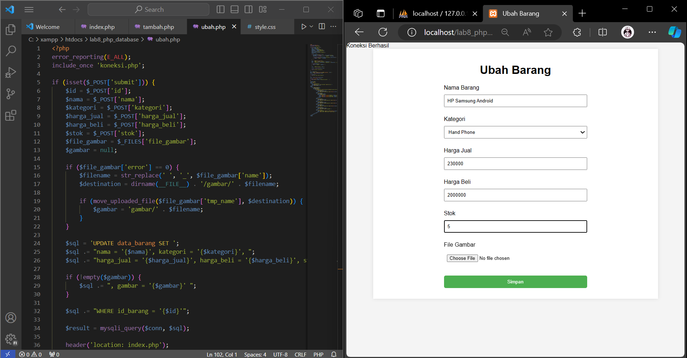

- Menghapus Data (Delete)

    Buat file baru dengan nama hapus.php

    Coding hapus.php => [klik ini](hapus.php)
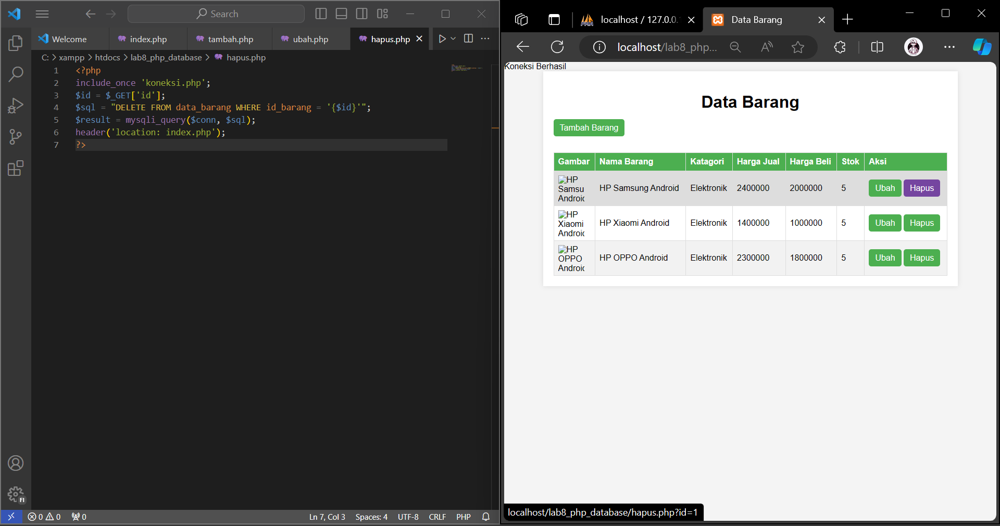

## Terimakasih salam Mahasiswa, Mohon maaf Atas segala Kekurangannya 🙏🎓😊

